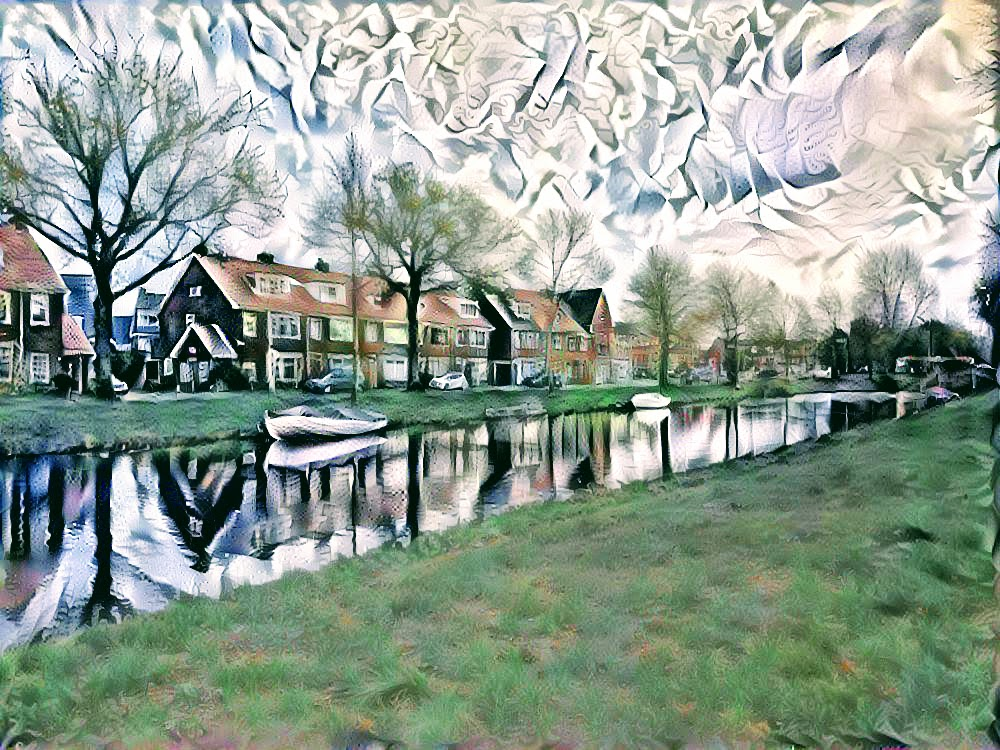

## About

Two implementations of Neural Style Transfer algorithm, using TensorFlow and TensorFlow 2.0 with Keras.

Code has been extracted from:

- Coursera: Convolutional Networks Course
- TensorFlow: Neural Style Transfer demo 

## Results

#### Van Gogh

TensorFlow

TensorFlow 2.0

#### Picaso - Guernica

TensorFlow

TensorFlow 2.0

#### Yayoi Kusama

TensorFlow

TensorFlow 2.0

## References:

<li>
  <a href="https://www.coursera.org/learn/convolutional-neural-networks/notebook/lEthw/art-generation-with-neural-style-transfer">Coursera NST</a>
</li>
<li>
<a href="https://www.tensorflow.org/tutorials/generative/style_transfer">Tensorflow2 NST</a>
</li>