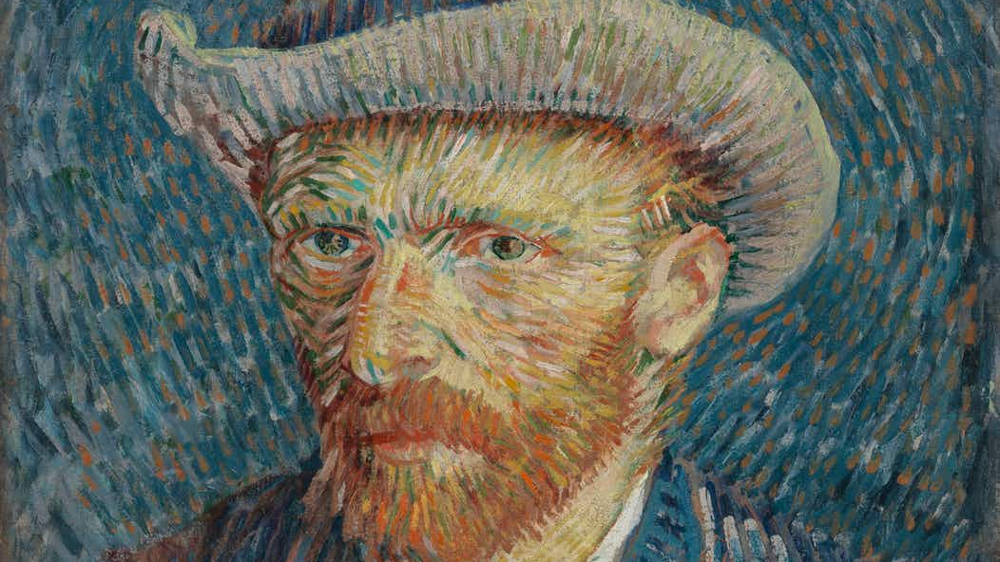
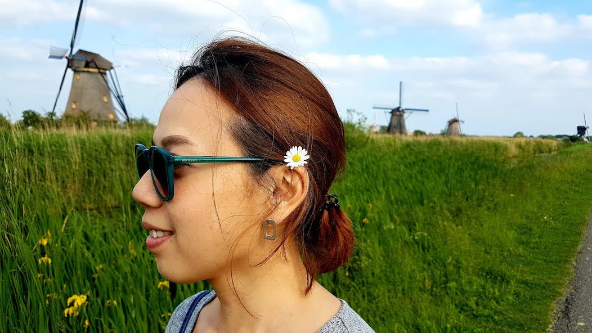
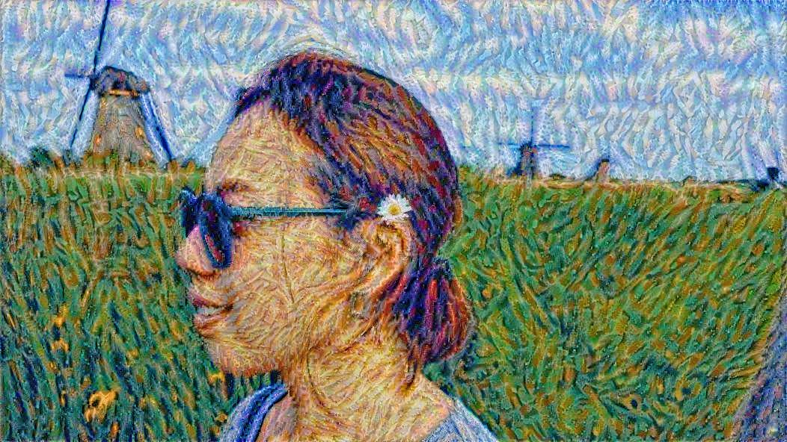
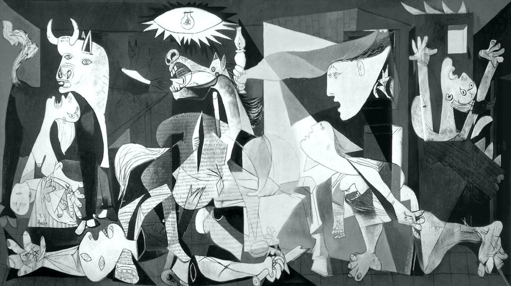
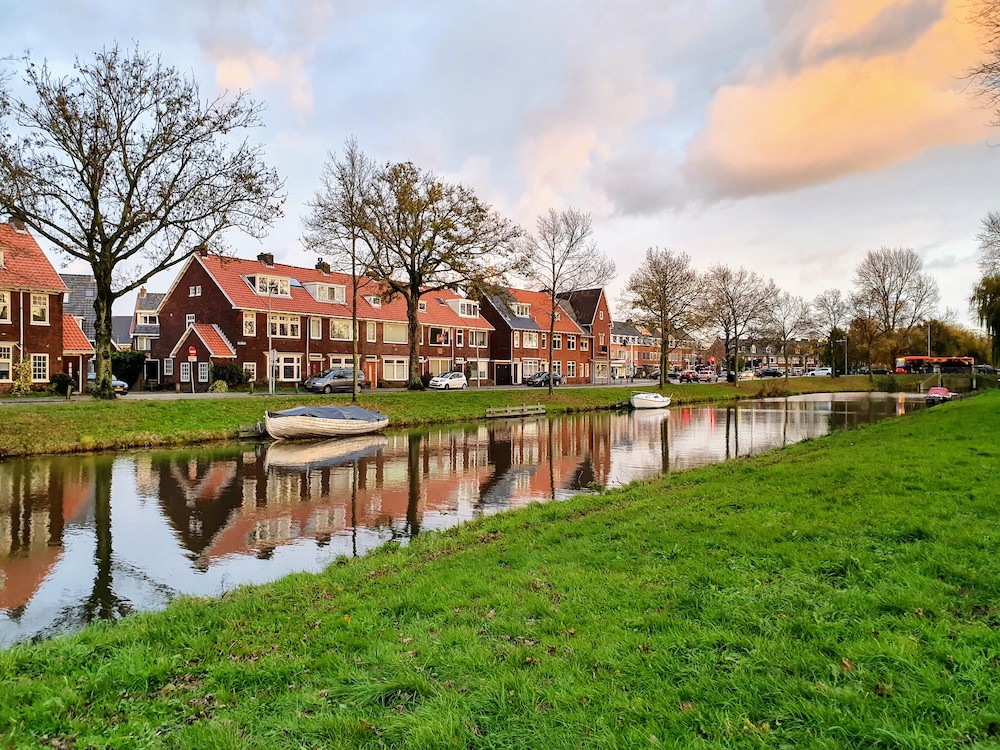
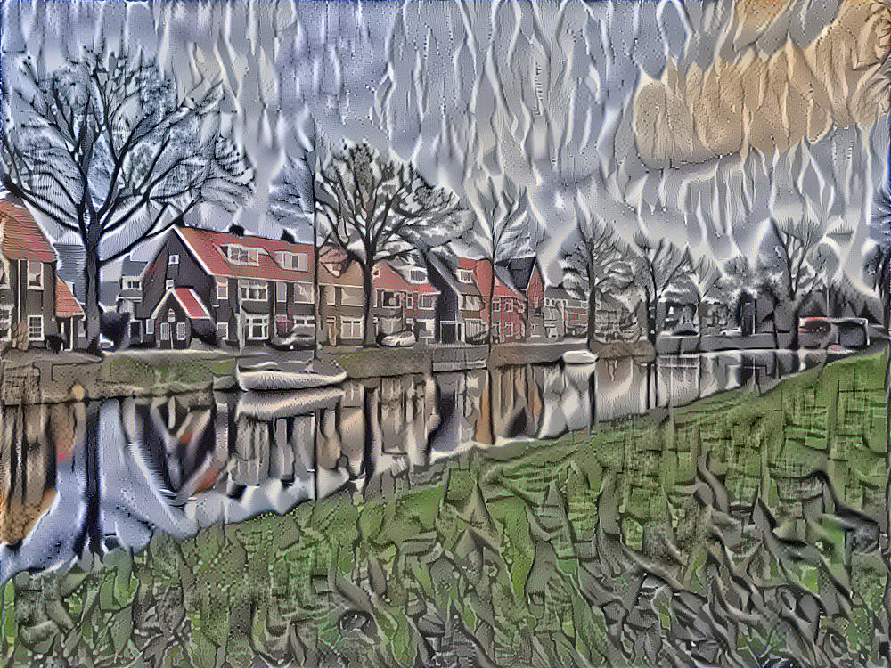
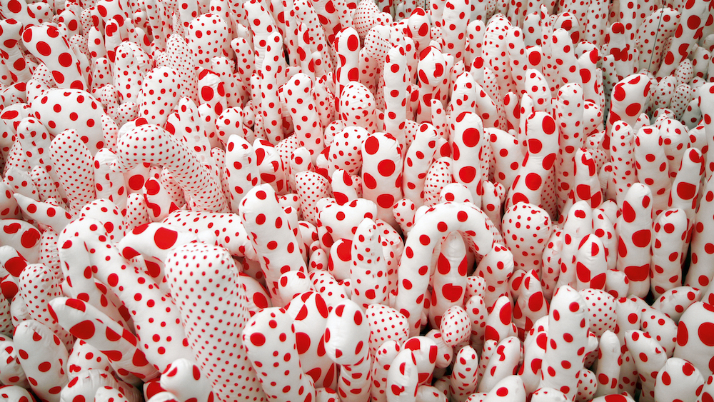
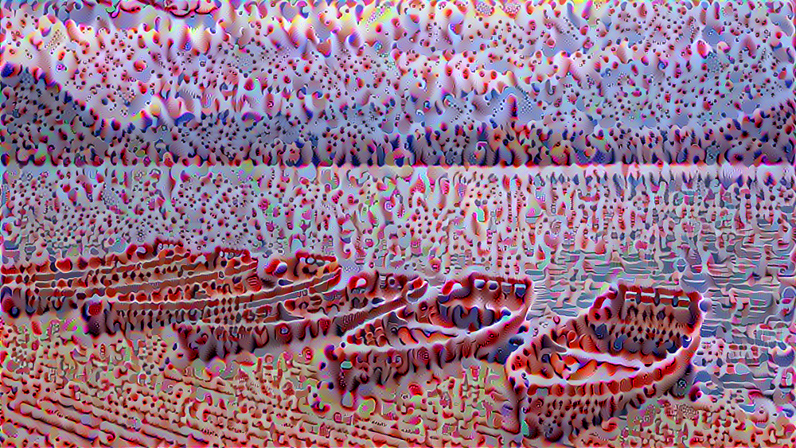
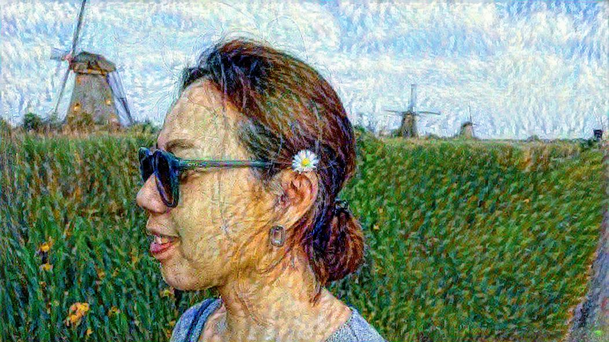

## About

Two implementations of Neural Style Transfer algorithm, using tensorflow and tensorflow2.

## Results

### Tensorflow

Van Gogh:

 

Guernica - Picaso:

 

Guernica - Picaso:

 

### Tensorflow 2

Van Gogh:

 
