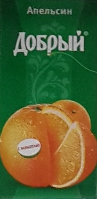
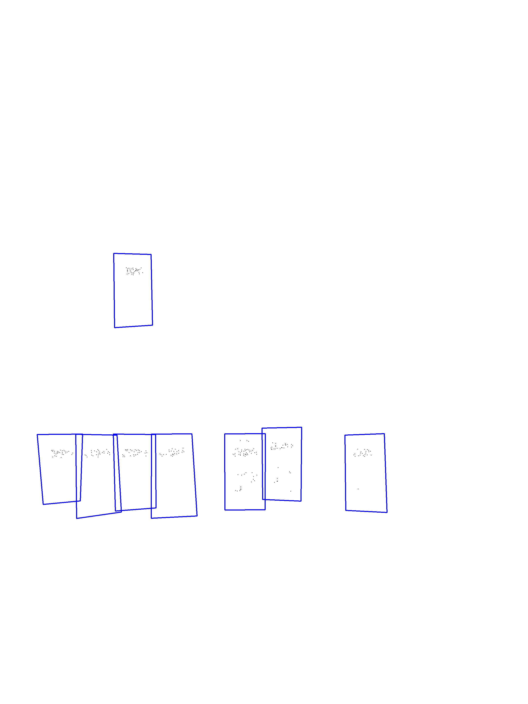
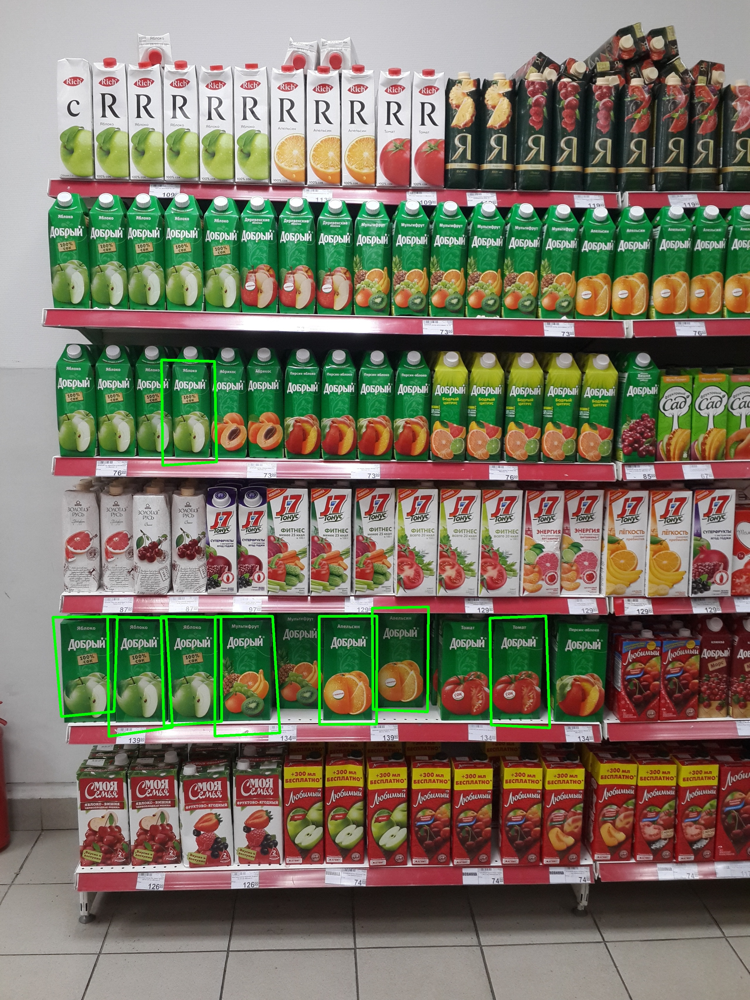

## About

Use AKAZE feature extraction for multiple object detection.

## How to

> python product_detector.py products/producto15.jpg products/estante3.jpg

## Results

Product:

Scene:

Keypoints and bounding boxes:

Detections:

